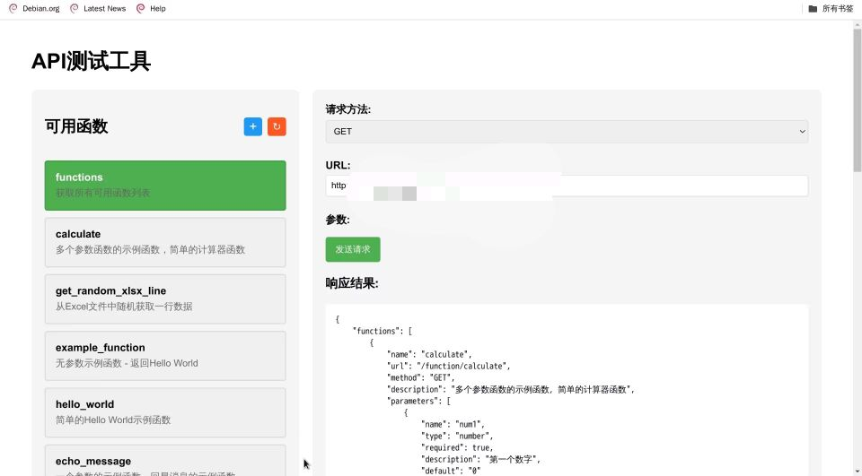

|  |  |
# 使用方法
## 本地直接运行
拉取项目后
安装依赖环境
```bash
pip3 install -r requirements.txt
```
直接运行main.py
web管理页面为http://ip:8000/admin/
## docker运行
拉取项目后在项目目录下终端运行
```bash
sudo docker-compose up -d
```
容器成功运行后web管理页面为http://ip:8000/admin/

# 如何添加新函数

本文档详细说明如何为云函数系统添加新的函数。

## 1. 目录结构

每个函数都需要一个独立的目录，目录名即为函数名。目录结构如下：

```
function_name/
├── function.py      # 函数实现（必需）
├── config.json      # 函数配置（必需）
├── intro.md         # 函数简介（必需）
├── readme.md        # 详细文档（可选）
├── requirements.txt # 依赖要求（可选）
└── xlsx_files/      # Excel文件目录（可选）
```

## 2. 必需文件说明

### 2.1 function.py

函数的具体实现文件，必须包含一个与目录同名的函数。

示例：
```python
def example_function(param1: str, param2: int = 0):
    """
    函数实现示例
    参数:
        param1: 第一个参数的说明
        param2: 第二个参数的说明，默认值为0
    返回:
        dict: 包含处理结果的字典
    """
    result = f"处理 {param1} 和 {param2}"
    return {"result": result}
```

### 2.2 config.json

API接口配置文件，定义函数的接口信息。

示例：
```json
{
    "url": "/function/example_function",
    "method": "GET",
    "description": "示例函数的简要描述",
    "parameters": [
        {
            "name": "param1",
            "type": "string",
            "required": true,
            "description": "第一个参数的说明",
            "default": ""
        },
        {
            "name": "param2",
            "type": "number",
            "required": false,
            "description": "第二个参数的说明",
            "default": "0"
        }
    ]
}
```

### 2.3 intro.md

函数的简短介绍，会显示在前端界面。

示例：
```markdown
这是一个示例函数，用于演示基本功能。

主要特点：
- 支持字符串参数处理
- 支持数值计算
- 返回JSON格式结果
```

## 3. 可选文件说明

### 3.1 requirements.txt

列出函数所需的Python包依赖。

示例：
```
requests>=2.26.0
pandas>=1.3.0
numpy>=1.21.0
```

### 3.2 readme.md

函数的详细文档。

建议包含：
- 功能详细说明
- 参数详细说明
- 返回值说明
- 使用示例
- 注意事项
- 更新记录

### 3.3 xlsx_files/

如果函数需要处理Excel文件，将文件放在这个目录中。

## 4. 支持的参数类型

- string: 字符串类型
- number: 数字类型（整数或浮点数）
- boolean: 布尔值（true/false）
- array: 数组类型
- object: 对象类型

## 5. 实际示例

### 5.1 简单的回显函数

```python
# echo_message/function.py
def echo_message(message: str = "Hello World"):
    """简单的消息回显函数"""
    return {"message": message}
```

```json
# echo_message/config.json
{
    "url": "/function/echo_message",
    "method": "GET",
    "description": "回显消息的示例函数",
    "parameters": [
        {
            "name": "message",
            "type": "string",
            "required": true,
            "description": "要回显的消息内容",
            "default": "Hello World"
        }
    ]
}
```

### 5.2 Excel处理函数

```python
# get_random_xlsx_line/function.py
import pandas as pd
import random
import os

def get_random_xlsx_line(filename: str):
    """从Excel文件中随机获取一行数据"""
    file_path = os.path.join('xlsx_files', filename)
    if not os.path.exists(file_path):
        return {"error": "文件不存在"}
    
    df = pd.read_excel(file_path)
    random_row = df.iloc[random.randint(0, len(df)-1)]
    return random_row.to_dict()
```

## 6. 注意事项

1. 函数命名规范：
   - 使用小写字母和下划线
   - 避免使用中文或特殊字符
   - 函数名必须与目录名完全一致

2. 参数设计：
   - 合理设置默认值
   - 提供清晰的参数说明
   - 注意参数类型的正确性

3. 返回值规范：
   - 必须返回可JSON序列化的数据
   - 建议使用字典格式
   - 包含适当的错误处理

4. 依赖管理：
   - 明确指定依赖版本
   - 避免不必要的依赖
   - 注意版本兼容性

5. 文档编写：
   - 使用清晰的语言
   - 提供具体的使用示例
   - 说明注意事项和限制

## 7. 上传方法

### 7.1 通过Web界面上传

1. 点击界面上的"+"按钮
2. 选择函数目录
3. 等待上传完成
4. 系统会自动：
   - 检查必需文件
   - 安装依赖
   - 添加路由
   - 刷新函数列表

### 7.2 手动添加

1. 将函数目录复制到 apps/ 目录下
2. 重启服务或点击刷新按钮

## 8. 调试建议

1. 本地测试：
   - 先在本地环境测试函数
   - 确保所有功能正常

2. 文件检查：
   - 确保所有必需文件存在
   - 检查文件格式是否正确

3. 参数验证：
   - 测试所有参数组合
   - 验证默认值是否合适

4. 错误处理：
   - 测试异常情况
   - 确保错误信息明确

5. 性能考虑：
   - 注意函数执行效率
   - 避免过大的依赖

## 9. 常见问题

1. 函数无法访问
   - 检查路由配置
   - 确认函数名正确

2. 依赖安装失败
   - 检查版本兼容性
   - 确认依赖可用性

3. 参数无法传递
   - 检查参数类型
   - 确认参数名称

4. 返回值错误
   - 检查数据格式
   - 确保可JSON化

## 10. 最佳实践

1. 代码风格
   - 遵循PEP 8规范
   - 添加适当的注释

2. 错误处理
   - 使用try-except
   - 返回明确的错误信息

3. 性能优化
   - 合理使用缓存
   - 避免重复计算

4. 安全考虑
   - 验证输入数据
   - 避免敏感信息泄露
